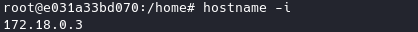

## Explicacion de proyecto

Se levantan dos contenedores Docker que están conectados entre sí: uno con Debian y otro con Vault. El sistema Debian contará con usuarios, grupos y contraseñas, y tendrá habilitado el servicio SSH para que cada usuario pueda conectarse, ya sea mediante su contraseña o usando su clave "id_rsa", la cual se encuentra en la carpeta de cada usuario.

Los grupos creados y los usuarios son los siguientes:

**Admins:** Leandro, Enzo

**Devs:** Juan, Sofia, Cristian, Nicolas, Sebastian

**Supports:** Ramiro, Camila, Hector

Las contraseñas seguras son generadas con `pwgen`, con una longitud de 12 caracteres. Los usuarios y contraseñas se envían a Vault, donde se guardan en diferentes "Secret", cada uno con el nombre correspondiente a su grupo.

## Demostración

Creamos las imagenes:

 ` docker compose build `

Ejecutamos los contenedores en segundo plano.

 ` docker compose up -d `

Accedemos al contenedor "debian".

 ` docker compose exec debian bash `

Vamos a poder ver los usuarios que se crearon.

Consultamos nuestra ip con ` hostname -i `

El docker de "vault" es el que se ejecuta primero asi que su ip sera una menos que la nuestra(seria "172.18.0.2" en este caso), por el navegador ponemos la direccion del docker "vault" con el numero de puerto por el que va a estar la web (puerto 8200).

URL: ` http://172.18.0.2:8200 `

El token asignado es "dev-only-token", una vez ingresado iremos al apartado de secret donde vamos a poder ver los grupos los cuales contienen las contraseñas de los usuarios que pertenecen a esta.

Usuarios y contraseñas del grupo devs.

Ahora vamos a acceder al usuario "Cristian" mediante ssh. 

Tambien se puede acceder mediante el uso de la "id_rsa" que se encuentra en la carpeta ".ssh" perteneciente a cada usuario, esto nos permitira conectarnos sin que te pidan contraseña.
